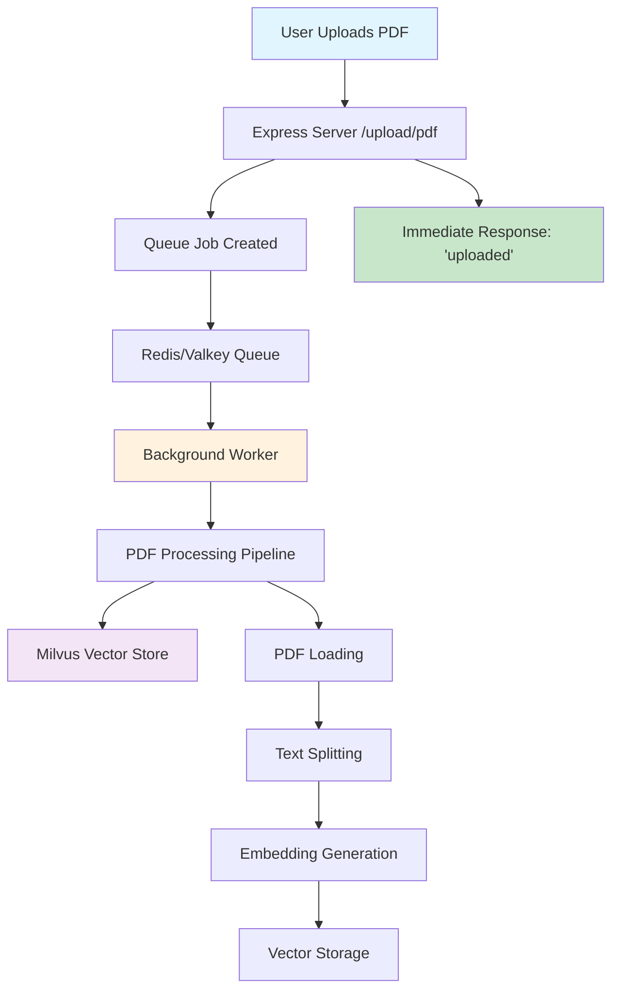

# Queue System Documentation

This document explains the queue system implementation in the PDF chatbot backend, why it's essential, and how it works.

## Table of Contents

- [Architecture Overview](#architecture-overview)
- [Why Queue System is Used](#why-queue-system-is-used)
- [What Would Happen Without Queue](#what-would-happen-without-queue)
- [Setup & Running Instructions](#setup--running-instructions)
- [Performance Metrics](#performance-metrics)
- [Monitoring & Troubleshooting](#monitoring--troubleshooting)
- [Production Considerations](#production-considerations)

## Architecture Overview

The queue system uses **BullMQ** with **Redis/Valkey** for asynchronous PDF processing. Here's how it works:



## Why Queue System is Used Here

The queue system (using **BullMQ** with **Redis/Valkey**) is implemented for **asynchronous PDF processing**. Here's why it's essential:

### 1. **Heavy PDF Processing Operations**

Looking at the `worker.js` file, each PDF upload triggers several resource-intensive operations:

- **PDF Loading**: Using `PDFLoader` to extract text from PDF files
- **Text Splitting**: Breaking documents into chunks (1000 characters with 200 overlap)
- **Embedding Generation**: Creating vector embeddings using OpenAI's API
- **Vector Storage**: Storing embeddings in Milvus vector database

### 2. **Non-blocking User Experience**

```javascript
// In index.js - upload endpoint
app.post('/upload/pdf', upload.single('pdf'), async (req, res) => {
  if (!req.file) {
    return res.status(400).json({ message: 'No file uploaded' });
  }
  await fileUploadQueue.add('process-file', {
    filename: req.file.originalname,
    destination: req.file.destination,
    path: req.file.path,
  });
  return res.json({ message: 'uploaded' }); // Immediate response
});
```

The user gets an immediate "uploaded" response while the actual processing happens in the background.

### 3. **Scalability and Concurrency**

```javascript
// In worker.js
const fileProcessingWorker = new Worker(
  'file-upload-queue',
  async (job) => {
    /* processing logic */
  },
  {
    concurrency: 5, // Process up to 5 files simultaneously
    connection: {
      /* Redis connection */
    },
  },
);
```

The worker can process multiple PDFs concurrently without blocking the main server.

### 4. **Reliability and Error Handling**

- **Job Retry**: Failed jobs can be automatically retried
- **Job Persistence**: Jobs survive server restarts (stored in Redis)
- **Error Tracking**: Failed jobs are logged and can be monitored

## What Would Happen Without the Queue System?

If you removed the queue system and processed PDFs synchronously:

### ❌ **Problems You'd Face:**

1. **Poor User Experience**

   - Users would wait 30-60+ seconds for PDF processing to complete
   - Browser timeouts on large files
   - No immediate feedback that upload was successful

2. **Server Performance Impact**

   - The `/upload/pdf` endpoint would be very slow (30-60+ seconds per request)
   - Other users couldn't upload files while one PDF is being processed
   - Other endpoints like `/chat` would still work but with degraded performance
   - Server becomes unresponsive under multiple simultaneous uploads

3. **Resource Exhaustion**

   - Multiple simultaneous uploads would overwhelm the server
   - Memory usage spikes during embedding generation
   - API rate limits hit faster (OpenAI embeddings API)

4. **No Fault Tolerance**

   - If processing fails, the entire request fails
   - No way to retry failed operations
   - Lost work if server crashes during processing

5. **Scalability Issues**
   - Can't handle multiple users uploading simultaneously
   - No way to distribute processing across multiple servers
   - Single point of failure

### 🔄 **Alternative Without Queue (Synchronous Approach):**

```javascript
// BAD: Synchronous processing
app.post('/upload/pdf', upload.single('pdf'), async (req, res) => {
  try {
    // This would block the server for 30-60+ seconds
    const loader = new PDFLoader(req.file.path);
    const docs = await loader.load();
    const chunks = await splitter.splitDocuments(docs);
    const embeddings = new OpenAIEmbeddings({...});
    await vectorStore.addDocuments(chunks);

    res.json({ message: 'processed successfully' });
  } catch (error) {
    res.status(500).json({ error: 'Processing failed' });
  }
});
```

### Summary

The queue system is **essential** for this PDF chatbot because:

- **PDF processing is CPU/memory intensive** and takes significant time
- **Users expect immediate feedback** when uploading files
- **The system needs to handle multiple concurrent uploads**
- **Reliability and fault tolerance** are crucial for production use
- **Scalability** allows the system to grow with user demand

Without the queue, your application would be slow, unreliable, and unable to handle real-world usage patterns. The queue system transforms a potentially unusable synchronous operation into a smooth, scalable, and user-friendly experience.

## What Gets Blocked Without Queue System

To answer your specific question about what would be blocked: **It depends on how Node.js handles the blocking operation, but in practice, it would primarily block the `/upload/pdf` endpoint, not necessarily ALL endpoints like `/chat`**.

### 🎯 **Primary Impact: `/upload/pdf` Endpoint**

If you process PDFs synchronously in the upload endpoint, here's what happens:

```javascript
// Synchronous processing (BAD)
app.post('/upload/pdf', upload.single('pdf'), async (req, res) => {
  // This async function will block THIS specific request
  // for 30-60+ seconds while processing
  const loader = new PDFLoader(req.file.path);
  const docs = await loader.load();
  // ... more processing
  res.json({ message: 'processed' });
});
```

**Result**: The specific user uploading the PDF waits 30-60+ seconds for a response.

### 🔄 **Secondary Impact: Other Endpoints**

**The `/chat` endpoint would NOT be completely blocked**, but there could be performance impacts:

1. **CPU/Memory Contention**:

   - PDF processing is CPU and memory intensive
   - This could slow down other operations on the same server
   - But `/chat` requests would still be processed (just slower)

2. **Event Loop Blocking** (if using synchronous operations):

   - If you used synchronous file operations (not async/await), it could block the entire Node.js event loop
   - But your current code uses async operations, so this is less likely

3. **Resource Exhaustion**:
   - High memory usage during PDF processing could affect overall server performance
   - API rate limits (OpenAI embeddings) could impact other operations

### 📊 **Real-World Scenario**

Let's say you have 3 users:

**With Queue System (Current)**:

```
User A: Uploads PDF → Gets immediate "uploaded" response
User B: Chats → Gets immediate response
User C: Chats → Gets immediate response
Background: PDF processing happens asynchronously
```

**Without Queue System (Synchronous)**:

```
User A: Uploads PDF → Waits 45 seconds for response
User B: Chats → Gets response (but might be slower due to resource contention)
User C: Chats → Gets response (but might be slower due to resource contention)
```

### 🚨 **The Real Problem: Multiple Uploads**

The bigger issue occurs when multiple users try to upload PDFs simultaneously:

```javascript
// Without queue - multiple uploads would stack up
User A: Uploads PDF → Processing starts (45 seconds)
User B: Uploads PDF → Processing starts (45 seconds)
User C: Uploads PDF → Processing starts (45 seconds)
// All three are now competing for CPU, memory, and API calls
```

This could lead to:

- **Memory exhaustion** (multiple PDFs being processed)
- **API rate limiting** (multiple embedding requests)
- **Server crashes** under load
- **All endpoints becoming slow/unresponsive**

### Summary

**Direct Answer**: Without the queue system:

- ✅ `/chat` endpoint would still work (not completely blocked)
- ❌ `/upload/pdf` endpoint would be very slow (30-60+ seconds)
- ⚠️ Overall server performance would degrade under load
- 🚨 Multiple simultaneous uploads could crash the server

The queue system prevents these issues by moving the heavy processing to background workers, keeping your main server responsive for all endpoints.

## Setup & Running Instructions

### Prerequisites

1. **Redis/Valkey Server**: Required for queue storage
2. **Milvus Vector Database**: Required for storing embeddings
3. **OpenAI API Key**: Required for embedding generation

### Environment Variables

Create a `.env` file with the following variables:

```bash
# OpenAI Configuration
OPENAI_API_KEY=your_openai_api_key_here

# Queue System (Redis/Valkey)
REDIS_HOST=localhost
REDIS_PORT=6379

# Vector Database
MILVUS_URL=http://localhost:19530
MILVUS_COLLECTION_NAME=pdf_documents

# Optional: OpenRouter for multiple models
OPENROUTER_API_KEY=your_openrouter_key_here
NEXT_PUBLIC_SITE_URL=http://localhost:3000

# Server Configuration
PORT=8000
CHAT_TIMEOUT_MS=120000
```

### Running the System

#### 1. Start Infrastructure Services

```bash
# Start Redis/Valkey and Milvus using Docker Compose
docker compose up
```

#### 2. Start the Main Server

```bash
# Development mode with auto-reload
npm run dev

# Or production mode
node index.js
```

#### 3. Start the Background Worker

```bash
# In a separate terminal - Development mode
npm run dev:worker

# Or production mode
node worker.js
```

### Queue Configuration

The queue system is configured with the following settings:

```javascript
// Queue Configuration (from index.js)
const fileUploadQueue = new Queue('file-upload-queue', {
  connection: {
    host: process.env.REDIS_HOST || 'localhost',
    port: parseInt(process.env.REDIS_PORT || '6379', 10),
  },
});

// Worker Configuration (from worker.js)
const fileProcessingWorker = new Worker(
  'file-upload-queue',
  async (job) => {
    /* processing logic */
  },
  {
    concurrency: 5, // Process up to 5 files simultaneously
    connection: {
      host: process.env.REDIS_HOST || 'localhost',
      port: parseInt(process.env.REDIS_PORT || '6379', 10),
    },
  },
);
```

### Testing the Queue System

1. **Upload a PDF**:

   ```bash
   curl -X POST -F "pdf=@your-file.pdf" http://localhost:8000/upload/pdf
   ```

2. **Check Queue Status** (using Redis CLI):
   ```bash
   redis-cli
   > LLEN bull:file-upload-queue:waiting
   > LLEN bull:file-upload-queue:active
   > LLEN bull:file-upload-queue:completed
   > LLEN bull:file-upload-queue:failed
   ```

## Performance Metrics

### Typical Processing Times

| PDF Size | Pages | Processing Time | Memory Usage |
| -------- | ----- | --------------- | ------------ |
| 1-5 MB   | 1-10  | 15-30 seconds   | 200-500 MB   |
| 5-15 MB  | 10-50 | 30-60 seconds   | 500MB-1GB    |
| 15+ MB   | 50+   | 60+ seconds     | 1GB+         |

### Queue Performance

- **Concurrency**: 5 simultaneous PDF processing jobs
- **Throughput**: ~10-20 PDFs per minute (depending on size)
- **Memory per Worker**: 200MB-1GB (varies with PDF size)
- **API Rate Limits**: OpenAI embeddings: 3000 requests/minute

### Resource Usage

```javascript
// Memory usage during processing
const memoryUsage = process.memoryUsage();
console.log({
  rss: `${Math.round(memoryUsage.rss / 1024 / 1024)} MB`, // Resident Set Size
  heapTotal: `${Math.round(memoryUsage.heapTotal / 1024 / 1024)} MB`,
  heapUsed: `${Math.round(memoryUsage.heapUsed / 1024 / 1024)} MB`,
  external: `${Math.round(memoryUsage.external / 1024 / 1024)} MB`,
});
```

## Monitoring & Troubleshooting

### Queue Monitoring

#### 1. Redis Commander (Web UI)

Access at `http://localhost:8081` to monitor queue status, jobs, and Redis data.

#### 2. Command Line Monitoring

```bash
# Check queue status
redis-cli
> KEYS bull:file-upload-queue:*
> LLEN bull:file-upload-queue:waiting
> LLEN bull:file-upload-queue:active
> LLEN bull:file-upload-queue:completed
> LLEN bull:file-upload-queue:failed

# Monitor failed jobs
> LRANGE bull:file-upload-queue:failed 0 -1
```

#### 3. Application Logs

```bash
# Monitor worker logs
tail -f worker.log

# Monitor server logs
tail -f server.log
```

### Common Issues & Solutions

#### 1. **Worker Not Processing Jobs**

```bash
# Check if worker is running
ps aux | grep worker.js

# Check Redis connection
redis-cli ping

# Restart worker
npm run dev:worker
```

#### 2. **Jobs Stuck in Queue**

```bash
# Check for stuck jobs
redis-cli
> LLEN bull:file-upload-queue:active

# Clear stuck jobs (use with caution)
> DEL bull:file-upload-queue:active
```

#### 3. **Memory Issues**

```bash
# Monitor memory usage
top -p $(pgrep -f worker.js)

# Restart worker if memory usage is too high
kill $(pgrep -f worker.js) && npm run dev:worker
```

#### 4. **API Rate Limiting**

- **OpenAI Embeddings**: 3000 requests/minute
- **Solution**: Implement exponential backoff or reduce concurrency

#### 5. **PDF Processing Failures**

```javascript
// Check worker error logs
fileProcessingWorker.on('failed', (job, err) => {
  console.error(`Job ${job.id} failed:`, err.message);
  // Implement retry logic or alerting
});
```

## Production Considerations

### Scaling the Queue System

#### 1. **Horizontal Scaling**

```bash
# Run multiple workers on different servers
# Worker 1
REDIS_HOST=redis-cluster.com node worker.js

# Worker 2
REDIS_HOST=redis-cluster.com node worker.js

# Worker 3
REDIS_HOST=redis-cluster.com node worker.js
```

#### 2. **Redis Cluster Setup**

```yaml
# docker-compose.prod.yml
version: '3.8'
services:
  redis-master:
    image: redis:7-alpine
    command: redis-server --appendonly yes
    volumes:
      - redis-master-data:/data

  redis-replica:
    image: redis:7-alpine
    command: redis-server --replicaof redis-master 6379
    depends_on:
      - redis-master

  redis-sentinel:
    image: redis:7-alpine
    command: redis-sentinel /usr/local/etc/redis/sentinel.conf
    volumes:
      - ./sentinel.conf:/usr/local/etc/redis/sentinel.conf
```

### Security Considerations

1. **Redis Security**:

   ```bash
   # Enable Redis AUTH
   redis-cli CONFIG SET requirepass "your-secure-password"
   ```

2. **Network Security**:

   - Use VPN or private networks for Redis/Milvus
   - Implement firewall rules
   - Use TLS for external connections

3. **API Key Management**:
   - Store API keys in secure environment variables
   - Use secret management services (AWS Secrets Manager, etc.)
   - Rotate keys regularly

### Performance Optimization

#### 1. **Worker Configuration**

```javascript
// Optimize worker settings
const fileProcessingWorker = new Worker(
  'file-upload-queue',
  async (job) => {
    /* processing logic */
  },
  {
    concurrency: 3, // Reduce if memory constrained
    removeOnComplete: 100, // Keep last 100 completed jobs
    removeOnFail: 50, // Keep last 50 failed jobs
    attempts: 3, // Retry failed jobs 3 times
    backoff: {
      type: 'exponential',
      delay: 2000,
    },
  },
);
```

#### 2. **Memory Management**

```javascript
// Add memory monitoring
setInterval(() => {
  const memUsage = process.memoryUsage();
  if (memUsage.heapUsed > 1024 * 1024 * 1024) {
    // 1GB
    console.warn('High memory usage detected:', memUsage);
    // Consider restarting worker
  }
}, 30000); // Check every 30 seconds
```

#### 3. **Queue Cleanup**

```javascript
// Clean up old jobs periodically
setInterval(async () => {
  await fileUploadQueue.clean(24 * 60 * 60 * 1000, 100); // Clean jobs older than 24 hours
}, 60 * 60 * 1000); // Run every hour
```

### Deployment Strategies

#### 1. **Docker Deployment**

```dockerfile
# Dockerfile.worker
FROM node:18-alpine
WORKDIR /app
COPY package*.json ./
RUN npm ci --only=production
COPY worker.js ./
CMD ["node", "worker.js"]
```

#### 2. **Kubernetes Deployment**

```yaml
# worker-deployment.yaml
apiVersion: apps/v1
kind: Deployment
metadata:
  name: pdf-worker
spec:
  replicas: 3
  selector:
    matchLabels:
      app: pdf-worker
  template:
    metadata:
      labels:
        app: pdf-worker
    spec:
      containers:
        - name: worker
          image: your-registry/pdf-worker:latest
          env:
            - name: REDIS_HOST
              value: 'redis-service'
            - name: OPENAI_API_KEY
              valueFrom:
                secretKeyRef:
                  name: api-secrets
                  key: openai-key
```

### Monitoring & Alerting

#### 1. **Metrics Collection**

```javascript
// Add Prometheus metrics
const promClient = require('prom-client');

const queueSize = new promClient.Gauge({
  name: 'queue_size',
  help: 'Number of jobs in queue',
  labelNames: ['queue_name', 'status'],
});

const processingTime = new promClient.Histogram({
  name: 'pdf_processing_duration_seconds',
  help: 'Time spent processing PDFs',
  buckets: [1, 5, 10, 30, 60, 120],
});
```

#### 2. **Alerting Rules**

```yaml
# prometheus-alerts.yml
groups:
  - name: queue-alerts
    rules:
      - alert: QueueBacklog
        expr: queue_size{status="waiting"} > 100
        for: 5m
        labels:
          severity: warning
        annotations:
          summary: 'High queue backlog detected'

      - alert: WorkerDown
        expr: up{job="pdf-worker"} == 0
        for: 1m
        labels:
          severity: critical
        annotations:
          summary: 'PDF worker is down'
```

## **Concurrency Setting Analysis**

Concurrency **5 might be too high** for most scenarios.

#### 1. **Memory Consumption**

```javascript
// Each PDF processing job uses:
// - 200MB-1GB memory per job
// - 5 concurrent jobs = 1GB-5GB total memory usage
// - This could cause out-of-memory errors
```

#### 2. **API Rate Limits**

```javascript
// OpenAI Embeddings API: 3000 requests/minute
// 5 concurrent jobs × multiple chunks per PDF = potential rate limiting
// Each PDF might have 10-50 chunks = 50-250 embedding requests per job
// 5 jobs × 50 chunks = 250 concurrent embedding requests
```

#### 3. **Server Resource Contention**

- **CPU**: PDF processing is CPU-intensive
- **Network**: Multiple concurrent API calls to OpenAI
- **Disk I/O**: Multiple files being read simultaneously

### 🎯 **Quick Concurrency Reference**

| Server Specs | RAM  | CPU | Recommended Concurrency | Max Memory Usage |
| ------------ | ---- | --- | ----------------------- | ---------------- |
| Small        | 2GB  | 2   | 1-2                     | 1-2GB            |
| Medium       | 4GB  | 4   | 2-3                     | 2-3GB            |
| Large        | 8GB  | 8   | 3-4                     | 3-4GB            |
| High-end     | 16GB | 16+ | 4-5                     | 4-5GB            |

### 🎯 **Recommended Concurrency Settings:**

#### **For Different Server Sizes:**

```bash
# Small server (2GB RAM, 2 CPU cores)
CONCURRENCY=2

# Medium server (4GB RAM, 4 CPU cores)
CONCURRENCY=3

# Large server (8GB+ RAM, 8+ CPU cores)
CONCURRENCY=4

# High-end server (16GB+ RAM, 16+ CPU cores)
CONCURRENCY=5
```

1. **Start with `CONCURRENCY=2`** for safety
2. **Monitor memory usage** with the new monitoring I added
3. **Gradually increase** if you see no memory issues
4. **Never exceed 5** even on high-end servers

### 📊 **Monitoring Concurrency Performance**

```bash
# Monitor memory usage
watch -n 1 'ps aux | grep worker.js | head -5'

# Check queue backlog
redis-cli LLEN bull:file-upload-queue:waiting

# Monitor API rate limits
curl -s http://localhost:8000/upload/queue/stats

# Check worker memory usage
top -p $(pgrep -f worker.js)

# Monitor Redis queue status
redis-cli
> LLEN bull:file-upload-queue:waiting
> LLEN bull:file-upload-queue:active
> LLEN bull:file-upload-queue:completed
> LLEN bull:file-upload-queue:failed
```

### ⚠️ **Warning Signs - Reduce Concurrency If You See:**

- **Memory warnings** in logs: `⚠️ High memory usage: 1024MB / 2048MB`
- **Out of memory errors**: `FATAL ERROR: Ineffective mark-compacts near heap limit`
- **API rate limit errors** from OpenAI: `Rate limit exceeded`
- **Jobs failing** due to timeouts: `Job timeout after 30 seconds`
- **Server becoming unresponsive**: High CPU usage, slow responses
- **Queue backlog growing**: More than 10 jobs waiting consistently
- **Worker crashes**: Process exits unexpectedly

### 🔄 **Dynamic Concurrency Adjustment**

```bash
# Reduce concurrency if issues occur
export CONCURRENCY=2
pm2 restart worker

# Or with Docker
docker-compose restart worker

# Increase gradually if stable
export CONCURRENCY=3
pm2 restart worker

# Monitor the changes
watch -n 5 'curl -s http://localhost:8000/upload/queue/stats'
```

### **Environment Variable Options:**

```bash
# Conservative (recommended for most servers)
CONCURRENCY=2

# Moderate (if you have 8GB+ RAM)
CONCURRENCY=3

# Aggressive (only for high-end servers with 16GB+ RAM)
CONCURRENCY=4

# Maximum (not recommended unless you have 32GB+ RAM)
CONCURRENCY=5
```

### **Testing Your Setup:**

```bash
# Test with low concurrency first
CONCURRENCY=2 npm run dev:worker

# Monitor the logs for memory warnings
# If no warnings, try increasing to 3
CONCURRENCY=3 npm run dev:worker
```

## 📋 **BullMQ Job Options Explained**

The queue system uses BullMQ job options to control retry behavior, memory management, and job lifecycle. Here's a detailed breakdown of each configuration option:

### 🔄 **`attempts: 3`**

- **Purpose**: Maximum number of retry attempts for failed jobs
- **Behavior**: If a job fails, it will be retried up to 3 times before being moved to the failed queue
- **Example**: Job fails → Retry 1 → Fails → Retry 2 → Fails → Retry 3 → Fails → Moved to failed queue
- **Default**: 3 (if not specified)
- **Best Practice**: 3 is usually sufficient for transient errors, but not too many to cause infinite retries

### ⏱️ **`backoff: { type: 'exponential', delay: 2000 }`**

- **Purpose**: Controls the delay between retry attempts
- **`type: 'exponential'`**: Each retry waits longer than the previous one
- **`delay: 2000`**: Base delay of 2000ms (2 seconds)
- **Retry Schedule**:
  - 1st retry: 2 seconds
  - 2nd retry: 4 seconds
  - 3rd retry: 8 seconds
- **Why Exponential**: Prevents overwhelming the system with rapid retries
- **Alternative Types**: `'fixed'` (same delay each time), `'linear'` (increasing by fixed amount)

### 🗑️ **`removeOnComplete: 10`**

- **Purpose**: Keeps only the last 10 completed jobs in Redis
- **Behavior**: Automatically removes older completed jobs to prevent Redis memory bloat
- **Memory Management**: Prevents unlimited growth of completed job data
- **Example**: If you have 50 completed jobs, only the most recent 10 are kept
- **Default**: 100 (if not specified)
- **Best Practice**: 10 is conservative for memory-constrained environments

### 🗑️ **`removeOnFail: 5`**

- **Purpose**: Keeps only the last 5 failed jobs in Redis
- **Behavior**: Automatically removes older failed jobs to prevent Redis memory bloat
- **Debugging**: Keeps recent failures for troubleshooting
- **Example**: If you have 20 failed jobs, only the most recent 5 are kept
- **Default**: 50 (if not specified)
- **Best Practice**: 5 is sufficient for debugging while saving memory

### 🎯 **Complete Configuration Breakdown**

```javascript
{
  attempts: 3,                    // Retry failed jobs 3 times
  backoff: {
    type: 'exponential',          // Each retry waits longer
    delay: 2000,                  // Start with 2 second delay
  },
  removeOnComplete: 10,           // Keep last 10 completed jobs
  removeOnFail: 5,                // Keep last 5 failed jobs
}
```

### 📊 **Real-World Example**

```javascript
// Job fails at 10:00 AM
// 1st retry: 10:00:02 AM (2 seconds later)
// 2nd retry: 10:00:06 AM (4 seconds later)
// 3rd retry: 10:00:14 AM (8 seconds later)
// Final failure: 10:00:14 AM → Moved to failed queue
```

### ⚙️ **Alternative Configurations**

#### **Conservative (Memory-Conscious)**

```javascript
{
  attempts: 2,
  backoff: { type: 'exponential', delay: 1000 },
  removeOnComplete: 5,
  removeOnFail: 3,
}
```

#### **Aggressive (High-Throughput)**

```javascript
{
  attempts: 5,
  backoff: { type: 'exponential', delay: 5000 },
  removeOnComplete: 50,
  removeOnFail: 20,
}
```

#### **Fixed Retry (Predictable)**

```javascript
{
  attempts: 3,
  backoff: { type: 'fixed', delay: 3000 },
  removeOnComplete: 10,
  removeOnFail: 5,
}
```

### 🚨 **Important Considerations**

1. **Memory Usage**: Lower `removeOnComplete`/`removeOnFail` = less Redis memory
2. **Debugging**: Higher `removeOnFail` = more failed jobs to investigate
3. **Retry Logic**: More `attempts` = more resilience but longer recovery time
4. **Backoff Strategy**: Exponential prevents system overload during outages

## Common alternatives to BullMQ

Yes. Common alternatives and when to choose them:

- Amazon SQS (+ SNS, S3)

  - Pros: fully managed, durable, simple retries/DLQs, scales easily
  - Cons: cloud lock-in, eventual consistency, costs
  - Use if you want zero-ops reliability

- RabbitMQ (amqplib/rascal)

  - Pros: mature, routing keys, exchanges, priorities, DLQs, ack/nack
  - Cons: you operate it; more config than Redis queues
  - Use if you need rich routing/topologies and strong delivery semantics

- Kafka (kafkajs)

  - Pros: high throughput, replay, partitioning, stream processing
  - Cons: heavy operationally; overkill for task queues
  - Use for event streams/analytics, not simple background jobs

- NATS / NATS JetStream

  - Pros: simple, fast, lightweight; JetStream adds persistence
  - Cons: ecosystem smaller than RabbitMQ/Kafka
  - Use for low-latency messaging with optional persistence

- Redis Streams (ioredis XREADGROUP)

  - Pros: stays in Redis; full control, no BullMQ abstraction
  - Cons: you implement groups/retries/DLQ yourself
  - Use if you want minimal deps and can own the mechanics

- Bee-Queue

  - Pros: simple, Redis-based like Bull
  - Cons: largely superseded by BullMQ; fewer features
  - Use only for legacy/simple cases

- Agenda (MongoDB)
  - Pros: cron-like jobs, Mongo-based persistence
  - Cons: less suited for high-throughput worker queues
  - Use for scheduled jobs if you already use Mongo

Recommendation for your use case (PDF processing, retries, concurrency, simple ops):

- Stick with BullMQ or move to SQS if you want managed durability and less ops.
- Choose RabbitMQ if you need advanced routing, DLQs, and well-defined semantics.

Migration scope (high-level):

- Replace `Queue.add` and `Worker` with the new client’s producer/consumer APIs.
- Re-implement: retries/backoff, progress reporting, job status endpoints, DLQ handling.
- Update `docker-compose.yml` (RabbitMQ/Kafka) or infra (SQS creds).
- Keep Multer/upload flow unchanged.
